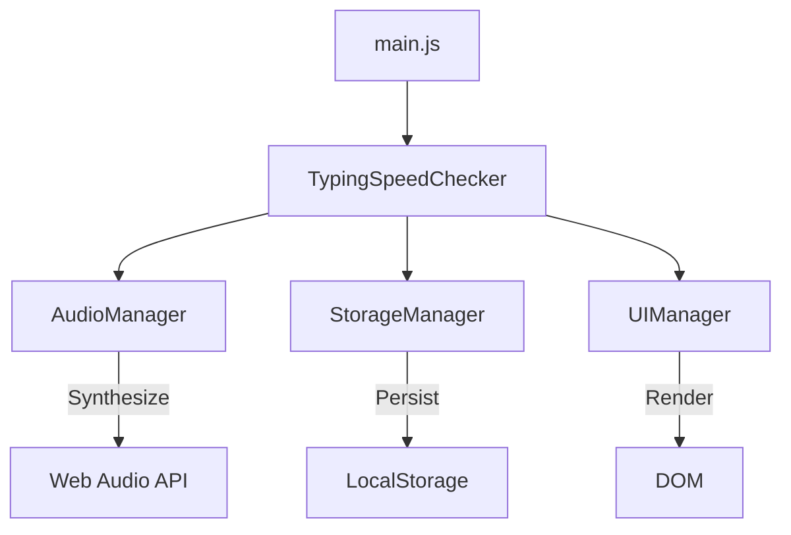
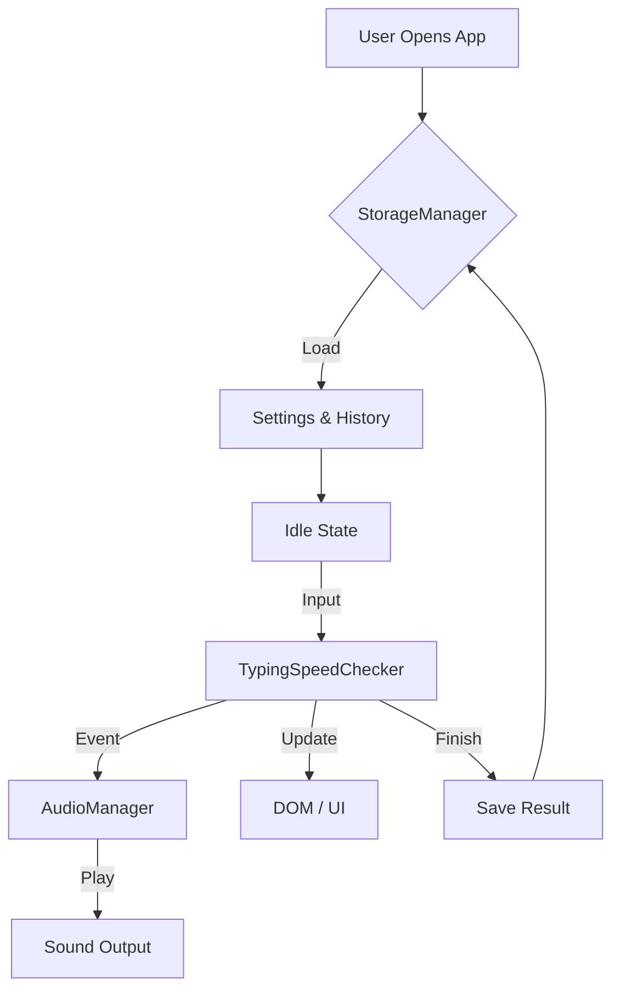
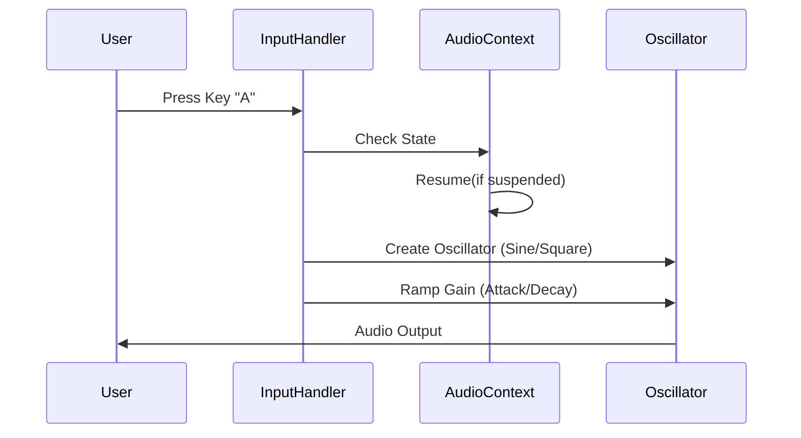

# DigitalDeft

   

**DigitalDeft** is a high-performance, privacy-first typing speed trainer built for developers and touch typists who value precision over bloat. It runs entirely client-side, saves data locally, and provides instant, distraction-free feedback.

This project proves its value by existing: **0ms latency, zero tracking, pure focus.**

---

## ⚡ Why This Tool Exists

Most typing tests have lost their way:
- They require verified accounts just to save a score.
- They are bloated with ad-trackers and heavy frameworks.
- They lag on slower devices, ruining the accuracy of the test itself.

**DigitalDeft** solves this by stripping away the noise. It is a raw, precise instrument for measuring human input speed.

---

## ⚖️ Before vs. After

| Feature | Standard Typing Sites | DigitalDeft |
| :--- | :--- | :--- |
| **Privacy** | Tracking pixels, Ads, Login Walls | **100% Offline, Incognito Mode** |
| **Performance** | React/Angular bloat, loading spinners | **Vanilla JS, Instant Load** |
| **Latency** | Network dependency | **0ms Input Lag** |
| **Customization** | Paywalled themes | **CSS Variables, Live Theming** |
| **Data** | Vendor-locked | **JSON Export/Import** |

---

## ⏱️ Use in Under 60 Seconds

### Method 1: The "I Just Want to Type" Way
1. Click the **Live Demo**: [https://aliriyaj007.github.io/DigitalDeft/](https://aliriyaj007.github.io/DigitalDeft/)
2. Start typing.

### Method 2: The "Offline Forever" Way
1. Download [DigitalDeft.html](https://github.com/Aliriyaj007/DigitalDeft/archive/refs/heads/main.zip) (Source ZIP).
2. Extract and double-click `index.html`.
3. Disconnect your internet. It still works.

---

## 🛠️ Installation & Setup

### For Developers (Git)
```bash
# 1. Clone the repository
git clone https://github.com/Aliriyaj007/DigitalDeft.git

# 2. Navigate to the folder
cd DigitalDeft

# 3. Open in browser (no build step required)
# Linux/Mac
open index.html 
# Windows
start index.html
```

---

## 🧩 Architecture & Flow

DigitalDeft is built with a modular architecture for scalability and maintainability.



### Core Flow


### Visualizing the Audio Engine 
The audio engine synthesizes sounds in real-time using the Web Audio API, avoiding large asset files.



---

## 🚀 Features at a Glance

- **Four Sound Packs**: Mechanical, Typewriter, Soft, Bubble (Synthesized).
- **Multiple Modes**: Time (15s-300s) or Word Count (10-500 words).
- **Developer Mode**: Practice with `JavaScript`, `Rust`, and `Python` keywords.
- **Focus & Zen**: `F` for Focus Mode, `Z` for Zen Mode.
- **Analytics**: Real-time WPM, Accuracy, and History tracking.
- **Portable**: Export your entire progress to a single JSON file.
- **Modular Codebase**: Cleanly separated logic for Audio, Storage, and UI.

---

## � Author & Contact

**Riyajul Ali**  
*Senior Maintainer & Developer*

- **GitHub**: [Aliriyaj007](https://github.com/Aliriyaj007)
- **LinkedIn**: [Aliriyaj007](https://linkedin.com/in/Aliriyaj007)
- **Email**: [aliriyaj007@protonmail.com](mailto:aliriyaj007@protonmail.com)
- **Web App**: [DigitalDeft Live](https://aliriyaj007.github.io/DigitalDeft/)

---

## � License

This project is licensed under the **MIT License**. You are free to fork, modify, and distribute this software.

```text
The MIT License (MIT)
Copyright (c) 2026 Riyajul Ali
```
